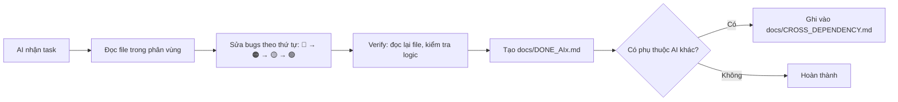

# 🗺️ CODEX 5-AGENT PARALLEL TASK MAP
# Dự án: QuanLyCongViec (SprintA)
# Ngày: 21/04/2026
# Target: 5 AI Codex model 5.4 chạy đồng thời

---

## ⚠️ QUY TẮC BẮT BUỘC CHO TẤT CẢ 5 AI

```
1. MỖI AI CHỈ ĐƯỢC SỬA CÁC FILE TRONG PHÂN VÙNG CỦA MÌNH (xem bảng phân vùng bên dưới)
2. KHÔNG ĐƯỢC SỬA FILE CỦA AI KHÁC - nếu cần thay đổi file ngoài phân vùng, ghi vào TODO.md
3. LUÔN ĐỌC FILE TRƯỚC KHI SỬA - dùng lệnh đọc file trước, không đoán nội dung
4. KHÔNG TẠO FILE MỚI NGOÀI PHÂN VÙNG - trừ khi file đó nằm trong folder mới do chính AI tạo
5. SAU KHI HOÀN THÀNH, tạo file DONE_AIx.md (x = số AI) trong thư mục docs/ để AI khác biết
6. NẾU GẶP LỖI LIÊN QUAN FILE CỦA AI KHÁC, ghi vào docs/CROSS_DEPENDENCY.md
7. BACKEND PORT: 5136 | FRONTEND PORT: 5173
8. DATABASE: SQL Server (connection string trong appsettings.json)
```

---

## 📁 CẤU TRÚC DỰ ÁN (GPS MAP)

```
QuanLyCongViec/
├── Backend/src/TaskManagement.API/
│   ├── Controllers/          ← 25 controllers (C# ASP.NET Core 10)
│   ├── Program.cs            ← Entry point
│   └── appsettings.json      ← Config + ConnectionString
├── Backend/src/TaskManagement.Domain/
│   └── Entities/             ← 48 entity models (Code First)
├── Backend/src/TaskManagement.Infrastructure/
│   └── ApplicationDbContext.cs
├── Frontend/src/
│   ├── views/                ← 27 page views (Vue 3)
│   ├── components/           ← 24 components
│   ├── store/                ← 5 Pinia stores
│   ├── router/               ← 8 route modules
│   └── api/axiosClient.js    ← Axios config + interceptors
└── docs/                     ← Tài liệu
```

---

## 🔀 BẢNG PHÂN VÙNG FILE (KHÔNG ĐƯỢC CHỒNG CHÉO)

| AI | Phân vùng Backend (Controllers) | Phân vùng Frontend (Views/Components) | Phân vùng khác |
|----|--------------------------------|---------------------------------------|----------------|
| **AI-1** | `WorkTasksController.cs`, `CommentsController.cs` | `TaskDetailModal.vue`, `SpaceSummary.vue` | `useWorkTaskStore.js` |
| **AI-2** | `DraftsController.cs`, `ModulesController.cs`, `LabelsController.cs` | `DraftsView.vue`, `ModulesTab.vue`, `ModulesView.vue`, `LabelManager.vue`, `FilterBar.vue` | — |
| **AI-3** | `ProjectsController.cs`, `ProjectMembersController.cs`, `NotificationsController.cs`, `WorkspacesController.cs` | `Dashboard.vue`, `ManageSpaces.vue`, `CreateProjectModal.vue`, `Home.vue`, `NotificationsDropdown.vue` | `useProjectStore.js`, `spaceRoutes.js`, `dashboardRoutes.js` |
| **AI-4** | `UsersController.cs`, `AdminUsersController.cs`, `SystemSettingsController.cs`, `AuditLogsController.cs`, `SecurityController.cs` | `Profile.vue`, `UserManagement.vue`, `AuditLog.vue`, `admin/*` | `adminRoutes.js`, `useAdminUserStore.js` |
| **AI-5** | `AiController.cs`, `GamificationController.cs`, `SprintsController.cs` | `AIPage.vue`, `RewardsView.vue`, `CyclesTab.vue`, `TimelineTab.vue`, `CalendarTab.vue`, `SpreadsheetTab.vue`, `KanbanBoard.vue`, `ListView.vue` | `useSprintStore.js`, `aiRoutes.js` |

---

## 📋 DANH SÁCH GAPS PHÂN LOẠI THEO MỨC ĐỘ

### Ký hiệu mức độ:
- 🔴 **CRITICAL** — App crash, mất dữ liệu, không dùng được
- 🟠 **HIGH** — Chức năng chính bị hỏng, ảnh hưởng trải nghiệm lớn
- 🟡 **MEDIUM** — Logic chưa đúng, UI chưa hoàn thiện
- 🟢 **LOW** — Cải thiện UX, thêm tính năng phụ

---

# 🤖 AI-1: TASK DETAIL & TASK CORE

## Prompt khởi động cho AI-1:

```
Bạn là AI-1 trong nhóm 5 AI. Phân vùng của bạn là:
- Backend: WorkTasksController.cs, CommentsController.cs
- Frontend: TaskDetailModal.vue, SpaceSummary.vue
- Store: useWorkTaskStore.js

Bạn KHÔNG ĐƯỢC sửa file ngoài danh sách trên.
Đọc file trước khi sửa. Sau khi xong tạo file docs/DONE_AI1.md
```

## Danh sách bugs & tasks:

| # | Mức độ | Mô tả | File cần sửa | Hướng xử lý |
|---|--------|-------|--------------|-------------|
| 1.1 | 🔴 | Cập nhật task luôn báo "Không thể cập nhật công việc" | `WorkTasksController.cs` → PUT endpoint, `TaskDetailModal.vue` → hàm updateTask | Kiểm tra RowVersion/concurrency, đảm bảo gửi đúng payload và backend trả 200 |
| 1.2 | 🔴 | Subtask hiển thị lên project board (phải ẩn, chỉ hiện trong task detail cha) | `SpaceSummary.vue` → computed tasks, `WorkTasksController.cs` → GET tasks | Filter: chỉ trả task có `parentTaskId == null` ở board, subtask chỉ hiện trong detail |
| 1.3 | 🟠 | Các nút Priority, Assignee, Status trên mỗi task card không click được (click = vào detail) | `SpaceSummary.vue` → template task card | Thêm `@click.stop` vào các dropdown/button Priority, Assignee, Status trên card |
| 1.4 | 🟠 | Kéo task sang cột IN_REVIEW và CANCELLED không hoạt động | `SpaceSummary.vue` → handleDraggableChange, `WorkTasksController.cs` | Thêm IN_REVIEW và CANCELLED vào danh sách status hợp lệ trong validation |
| 1.5 | 🟠 | List View không kéo đổi trạng thái được | `SpaceSummary.vue` → list view section | Thêm dropdown đổi status inline trong list view row |
| 1.6 | 🟠 | Description: bôi đen text không đổi được formatting (bold, italic, underline, code) | `TaskDetailModal.vue` → editor section | Fix execCommand hoặc chuyển sang dùng contentEditable đúng cách |
| 1.7 | 🟠 | Nút code format: click vào tạo dòng rác, phải giữ mode code cho tới khi user tắt | `TaskDetailModal.vue` → toolbar code button | Toggle state: khi bật code mode thì mọi text nhập vào đều là code block |
| 1.8 | 🟠 | Attachment trong description báo lỗi "File se khong chen vao description" | `TaskDetailModal.vue` → attachment handler | Xóa nút attach trong description toolbar, giữ attachment riêng biệt |
| 1.9 | 🟡 | Comment: lỗi giống description (format, gửi file code, file đính kèm PDF/Word/Excel) | `TaskDetailModal.vue` → comment section, `CommentsController.cs` | Fix format giống description, thêm upload file đính kèm (không phải code) |
| 1.10 | 🟡 | Comment dạng code phải hiển thị trong khung code block riêng biệt | `TaskDetailModal.vue` → comment render | Wrap comment có flag `isCode` trong `<pre><code>` block |
| 1.11 | 🟡 | Giữ chuột trái kéo ra ngoài task detail → tự đóng modal | `TaskDetailModal.vue` → overlay event | Đổi `@click.self` thành `@mousedown.self` hoặc thêm logic kiểm tra drag |
| 1.12 | 🟡 | Góc trên trái: chỉ giữ nút Back, bỏ nút phóng to, bỏ nút M + mũi tên | `TaskDetailModal.vue` → header | Xóa các nút thừa, giữ lại 1 nút Back |
| 1.13 | 🟡 | Icon emote: click phải hiện emoji picker, lưu reaction count vào DB | `TaskDetailModal.vue`, `CommentsController.cs` | Tích hợp emoji picker, gọi API reaction |
| 1.14 | 🟡 | Thời gian "Last edited by X about 10 hours ago" hiển thị sai/không real-time | `TaskDetailModal.vue` → activity section | Dùng computed tính relative time từ `updatedAt` |
| 1.15 | 🟡 | Activity tab báo lỗi "Activity đang hiển thị..." | `TaskDetailModal.vue` → activity tab | Gọi API audit log cho task, hiển thị timeline hoạt động |
| 1.16 | 🟡 | Display toggle subtask: bật = hiện subtask, tắt = ẩn | `TaskDetailModal.vue` → display options | Thêm toggle computed show/hide subtask list |
| 1.17 | 🟡 | Click ảnh đính kèm: thêm nút delete + kéo dãn hình ảnh | `TaskDetailModal.vue` → attachment images | Thêm overlay với nút delete + handle resize |
| 1.18 | 🟢 | Parent task selector hiển thị R-1, R-2, R-3 (phải xóa, chỉ hiện task thật) | `TaskDetailModal.vue` → parent dropdown | Lọc list chỉ lấy task cùng projectId, bỏ mock data |

---

# 🤖 AI-2: DRAFTS, MODULES, LABELS, FILTER

## Prompt khởi động cho AI-2:

```
Bạn là AI-2 trong nhóm 5 AI. Phân vùng của bạn là:
- Backend: DraftsController.cs, ModulesController.cs, LabelsController.cs
- Frontend: DraftsView.vue, ModulesTab.vue, ModulesView.vue, LabelManager.vue, FilterBar.vue

Bạn KHÔNG ĐƯỢC sửa file ngoài danh sách trên.
Đọc file trước khi sửa. Sau khi xong tạo file docs/DONE_AI2.md
```

## Danh sách bugs & tasks:

| # | Mức độ | Mô tả | File cần sửa | Hướng xử lý |
|---|--------|-------|--------------|-------------|
| 2.1 | 🔴 | Drafts: tạo 1000 bản nháp → server đứng | `DraftsController.cs` → GET endpoint | Thêm pagination: `?page=1&pageSize=20`, thêm index DB |
| 2.2 | 🔴 | Drafts: không có dữ liệu vào (API không trả data) | `DraftsView.vue` → fetchDrafts, `DraftsController.cs` | Debug API response, kiểm tra query filter |
| 2.3 | 🟠 | Drafts: 2 nút Start Date và Due Date không click được | `DraftsView.vue` → date picker elements | Kiểm tra v-model binding và el-date-picker component |
| 2.4 | 🟠 | Drafts: cải thiện hiệu suất khi >1000 bản nháp | `DraftsView.vue`, `DraftsController.cs` | Virtual scroll frontend + pagination backend |
| 2.5 | 🟠 | Modules: load chậm | `ModulesController.cs`, `ModulesTab.vue` | Thêm pagination, lazy load, giảm payload API |
| 2.6 | 🟠 | Modules: không cập nhật được công việc nhưng vẫn hiển thị trong module | `ModulesController.cs` → PUT endpoint | Fix logic update IssueModule relationship |
| 2.7 | 🟠 | Modules: chọn lịch không real-time | `ModulesTab.vue` → date picker, `ModulesController.cs` | Đảm bảo `@change` emit + gọi API PUT ngay |
| 2.8 | 🟡 | Modules: tính toán phần trăm chưa rõ đúng/sai | `ModulesTab.vue`, `ModulesController.cs` | Tính % = (tasks DONE / total tasks) * 100, thêm unit test |
| 2.9 | 🟡 | Modules: 2 nút sắp xếp (Name, etc.) + Filter chưa hoạt động | `ModulesTab.vue` | Thêm sort computed + tái sử dụng logic filter từ task |
| 2.10 | 🟡 | Modules: 3 nút trong box bên trái nút Add Module (đối chiếu Plane) | `ModulesTab.vue` | Mở Plane UI tham khảo, thêm 3 nút: Grid/List/Status view toggle |
| 2.11 | 🟠 | Labels trong Cycle: cột labels không click được | `LabelsController.cs`, `LabelManager.vue` | Kiểm tra API GET labels by projectId, fix dropdown binding |
| 2.12 | 🟡 | Labels: DB có data nhưng dropdown không hiện | `LabelsController.cs` → GET, `LabelManager.vue` | Debug API response, kiểm tra projectId filter trong query |
| 2.13 | 🟠 | Filter: hay bị ẩn sau giao diện (z-index) | `FilterBar.vue` | Set `z-index: 9999` + `position: fixed` hoặc teleport to body |

---

# 🤖 AI-3: PROJECT, DASHBOARD, SIDEBAR, THÔNG BÁO, TÌM KIẾM

## Prompt khởi động cho AI-3:

```
Bạn là AI-3 trong nhóm 5 AI. Phân vùng của bạn là:
- Backend: ProjectsController.cs, ProjectMembersController.cs, NotificationsController.cs, WorkspacesController.cs
- Frontend: Dashboard.vue, ManageSpaces.vue, CreateProjectModal.vue, Home.vue, NotificationsDropdown.vue
- Store: useProjectStore.js
- Router: spaceRoutes.js, dashboardRoutes.js

Bạn KHÔNG ĐƯỢC sửa file ngoài danh sách trên.
Đọc file trước khi sửa. Sau khi xong tạo file docs/DONE_AI3.md
```

## Danh sách bugs & tasks:

| # | Mức độ | Mô tả | File cần sửa | Hướng xử lý |
|---|--------|-------|--------------|-------------|
| 3.1 | 🟠 | Sidebar Project: chỉ hiện "Cun", phải hiện tất cả projects + click expand xem workitems/cycles/modules/views/pages | `Home.vue` hoặc layout sidebar, `useProjectStore.js` | Fetch all projects from API, render collapsible tree |
| 3.2 | 🟠 | Task hiển thị không đúng project (logic filter projectId) | `ProjectsController.cs` → discovery endpoint | Đảm bảo API trả task theo projectId chính xác |
| 3.3 | 🟡 | Tạo Project: cover chỉ là màu đơn sắc, muốn hình phong cảnh/thành phố | `CreateProjectModal.vue` | Thêm gallery ảnh cover (dùng picsum.photos hoặc unsplash random) |
| 3.4 | 🟠 | Nút bánh răng (Settings) trong Project: admin bấm không vào được admin page | `spaceRoutes.js`, `CreateProjectModal.vue` hoặc sidebar | Fix route: click gear → navigate to `/admin/project/{id}/settings` |
| 3.5 | 🟠 | Dashboard: bấm ngôi sao Favorite → F5 biến mất | `Dashboard.vue`, `ProjectsController.cs` | Tạo API PUT `/projects/{id}/favorite`, lưu vào DB field `isFavorite` |
| 3.6 | 🟡 | Dashboard: bỏ chữ "Cường", đổi thành "SprintA" | `Dashboard.vue` | Thay hardcoded name bằng project name từ API |
| 3.7 | 🟠 | Dashboard: nút "New Work Item" click không có gì xảy ra | `Dashboard.vue` | Mở modal tạo task mới (đối chiếu Plane: mở quick-add panel) |
| 3.8 | 🟠 | Thanh tìm kiếm trên đầu trang không hoạt động | `Home.vue` hoặc layout header | Gắn logic: gọi API search `/worktasks?search=keyword` + hiện kết quả dropdown |
| 3.9 | 🟠 | Chuông thông báo không hoạt động | `NotificationsDropdown.vue`, `NotificationsController.cs` | Gắn logic: fetch GET `/notifications` khi click, mark read khi xem, và mỗi thông báo khi xuất hiện phải lưu vào Notification |
| 3.10 | 🟡 | Thông báo: cần logic gì? | `NotificationsController.cs` | Tạo notification khi: assign task, comment mới, status thay đổi, mention |

---

# 🤖 AI-4: ADMIN, HỒ SƠ, QUẢN TRỊ HỆ THỐNG

## Prompt khởi động cho AI-4:

```
Bạn là AI-4 trong nhóm 5 AI. Phân vùng của bạn là:
- Backend: UsersController.cs, AdminUsersController.cs, SystemSettingsController.cs, AuditLogsController.cs, SecurityController.cs
- Frontend: Profile.vue, UserManagement.vue, AuditLog.vue, views/admin/*
- Router: adminRoutes.js
- Store: useAdminUserStore.js

Bạn KHÔNG ĐƯỢC sửa file ngoài danh sách trên.
Tham khảo dự án Plane tại D:\A\plane để đối chiếu admin features.
Sau khi xong tạo file docs/DONE_AI4.md
```

## Danh sách bugs & tasks:

| # | Mức độ | Mô tả | File cần sửa | Hướng xử lý |
|---|--------|-------|--------------|-------------|
| 4.1 | 🟠 | Click Settings trong project → về Home, không redirect qua Admin | `adminRoutes.js`, layout sidebar | Fix route guard: kiểm tra role, redirect đúng `/admin/...` |
| 4.2 | 🟠 | Profile: không có logic, cần code toàn bộ | `Profile.vue`, `UsersController.cs` | Gắn API GET/PUT profile, upload avatar, hiển thị tên đăng nhập |
| 4.3 | 🟡 | Profile: không kéo lên xuống được (scroll) | `Profile.vue` | Fix CSS: `overflow-y: auto` trên container chính |
| 4.4 | 🟡 | Profile: bỏ nút "Chuyển tài khoản" | `Profile.vue` | Xóa button switch account |
| 4.5 | 🟡 | Admin: đối chiếu Plane, bổ sung gì? | `admin/*`, tham khảo `D:\A\plane` | Thêm: quản lý trạng thái mặc định (Backlog, Todo, In Progress, In Review, Done, Cancelled) |
| 4.6 | 🟡 | Admin: quản lý phòng ban + role theo seed_data | `AdminUsersController.cs`, `UserManagement.vue` | CRUD departments, assign role per project, hiển thị theo role đã seed |
| 4.7 | 🟡 | Admin: quản lý trạng thái project (CRUD status) | `SystemSettingsController.cs`, `admin/*` | Tạo UI quản lý status: thêm/sửa/xóa, set default statuses |
| 4.8 | 🟡 | RBAC: đăng nhập role nào → chỉ thấy project được assign | `SecurityController.cs`, `adminRoutes.js` | Thêm middleware kiểm tra ProjectMember, filter project list |

---

# 🤖 AI-5: AI TÍCH HỢP, GAMIFICATION, TIMELINE/CALENDAR/VIEWS, HIỆU SUẤT

## Prompt khởi động cho AI-5:

```
Bạn là AI-5 trong nhóm 5 AI. Phân vùng của bạn là:
- Backend: AiController.cs, GamificationController.cs, SprintsController.cs
- Frontend: AIPage.vue, RewardsView.vue, CyclesTab.vue, TimelineTab.vue, CalendarTab.vue, SpreadsheetTab.vue, KanbanBoard.vue, ListView.vue
- Store: useSprintStore.js
- Router: aiRoutes.js

Bạn KHÔNG ĐƯỢC sửa file ngoài danh sách trên.
Sau khi xong tạo file docs/DONE_AI5.md
Ngoài ra, tạo file docs/performance-optimization-report.md
```

## Danh sách bugs & tasks:

| # | Mức độ | Mô tả | File cần sửa | Hướng xử lý |
|---|--------|-------|--------------|-------------|
| 5.1 | 🟠 | AI phân rã task báo lỗi 503 Gemini unavailable | `AiController.cs`, `AIPage.vue` | Thêm retry logic 3 lần + fallback message, hiển thị tiến trình phân tích |
| 5.2 | 🟠 | Nút gửi tin nhắn cho AI không hoạt động | `AIPage.vue` | Fix `@click` handler trên nút send, gắn v-model vào input |
| 5.3 | 🟡 | AI phải gửi lệnh phân rã vào chat box + hiển thị tiến trình thinking | `AIPage.vue`, `AiController.cs` | Streaming response hoặc loading animation + step-by-step display |
| 5.4 | 🟡 | AI đọc GitHub repo: chọn repo → phân tích file → đề xuất task | `AiController.cs`, `AIPage.vue` | Tích hợp GitHub API (nếu có token), list repos, analyze structure |
| 5.5 | 🟠 | Timeline: nút "New Work Item" không thêm được task | `TimelineTab.vue` | Gắn handler mở quick-add modal, gọi API POST task |
| 5.6 | 🟡 | Timeline: click vào bar trên timeline không có gì | `TimelineTab.vue` | Thêm `@click` mở task detail modal |
| 5.7 | 🟡 | Timeline: tab Tháng/Quý chỉ căn giữa/phải, không hiện tiến độ theo tháng/quý | `TimelineTab.vue` | Tính lại dateScale cho monthly/quarterly view, render đúng position |
| 5.8 | 🟡 | Calendar: hover vào ngày không hiện tooltip/task preview (đối chiếu Plane) | `CalendarTab.vue` | Thêm hover tooltip hiển thị danh sách task trong ngày đó |
| 5.9 | 🟡 | Display options: các mục lọc không hoạt động | `SpreadsheetTab.vue` hoặc display panel | Gắn logic filter cho từng option trong display dropdown |
| 5.10 | 🟡 | Toggle Create Mode: kiểm tra có cần logic không | Xem Plane reference | Nếu Plane có: bật = click vào board tạo task nhanh. Nếu không: bỏ nút |

### Nghiệp vụ Gamification (AI-5):

| # | Mức độ | Mô tả | File cần sửa |
|---|--------|-------|-------------|
| 5.G1 | 🟡 | Thiết kế hệ thống điểm: Giá trị × Ảnh hưởng × Số ngày = Tổng điểm | `GamificationController.cs`, `RewardsView.vue` |
| 5.G2 | 🟡 | Chia điểm theo % đóng góp trong task/cycle/module | `GamificationController.cs` |
| 5.G3 | 🟡 | Hoàn thành sớm → bonus 10% | `GamificationController.cs` |
| 5.G4 | 🟡 | Vòng tròn % trên mỗi task card (hover mới thấy số) | `KanbanBoard.vue`, `ListView.vue` |
| 5.G5 | 🟡 | Level system: lên level càng chậm, đến mốc = thăng chức | `GamificationController.cs`, `RewardsView.vue` |

### Bài toán Hiệu suất (AI-5 tạo file riêng):

```
Tạo file: docs/performance-optimization-report.md

Nội dung phân tích:
1. Frontend: virtual list, lazy load, code splitting, cache, pagination
2. Backend: pagination API, DTO, async/await, MemoryCache/Redis
3. Database: index (ProjectId, Status, AssigneeId, CreatedAt), N+1 query
4. Benchmark: 1000+ tasks, 100 concurrent users
5. Đề xuất cải thiện cụ thể với code mẫu Vue + C# + SQL
```

---

## 🔄 QUY TRÌNH LÀM VIỆC CHUNG



---

## 📝 MẪU FILE DONE_AIx.md

```markdown
# ✅ AI-x COMPLETED

## Đã sửa:
- [ ] Bug 1.1: Mô tả ngắn → Fixed
- [ ] Bug 1.2: Mô tả ngắn → Fixed

## File đã thay đổi:
- `path/to/file1.vue` — Mô tả thay đổi
- `path/to/file2.cs` — Mô tả thay đổi

## Dependencies cần AI khác xử lý:
- AI-3 cần update route cho task detail
- AI-2 cần sync label API

## Ghi chú:
- Cần test lại sau khi AI-3 hoàn thành mục 3.4
```

---

## 📝 MẪU FILE CROSS_DEPENDENCY.md

```markdown
# 🔄 Cross Dependencies

| Từ AI | Cần AI | File | Mô tả |
|-------|--------|------|-------|
| AI-1 | AI-2 | LabelsController.cs | AI-1 cần API labels hoạt động để hiện dropdown trong task detail |
| AI-3 | AI-1 | SpaceSummary.vue | AI-3 fix sidebar nhưng cần AI-1 fix filter subtask trước |
```

---

## ⚡ THỨ TỰ ƯU TIÊN TỔNG THỂ

```
PHASE 1 (Làm trước - 🔴 CRITICAL):
├── AI-1: Fix cập nhật task lỗi (1.1) + subtask leak (1.2)
├── AI-2: Fix drafts crash server (2.1) + drafts no data (2.2)
├── AI-3: Fix sidebar projects (3.1) + favorite mất (3.5)
└── AI-4: Fix admin redirect (4.1)

PHASE 2 (Làm tiếp - 🟠 HIGH):
├── AI-1: Fix click handlers (1.3), drag status (1.4), description (1.6-1.8)
├── AI-2: Fix modules slow (2.5), filter z-index (2.13), labels (2.11-2.12)
├── AI-3: Fix search (3.8), notifications (3.9), new work item (3.7)
├── AI-4: Fix profile (4.2), RBAC (4.8)
└── AI-5: Fix AI errors (5.1-5.2), timeline (5.5-5.7)

PHASE 3 (Cuối cùng - 🟡🟢):
├── AI-1: Comments, emoji, activity, UI cleanup
├── AI-2: Module %, sort, 3-button box
├── AI-3: Project cover images, tên hiển thị
├── AI-4: Admin features, departments, status management
└── AI-5: Gamification system, Calendar hover, performance report
```

---

## 🔍 THAM KHẢO PLANE

Dự án Plane gốc nằm tại: `D:\A\plane`
- Khi cần đối chiếu giao diện/logic, AI có thể đọc source code Plane ở đường dẫn trên
- Ưu tiên đối chiếu các file:
  - Admin settings: `D:\A\plane\web\app\` (Next.js pages)
  - API logic: `D:\A\plane\apiserver\` (Django REST)
  - Components: `D:\A\plane\web\components\`
