# 📊 TỔNG HỢP SƠ ĐỒ MERMAID CHO BÁO CÁO DỰ ÁN

**Dự án:** QuanLyCongViec (SprintA)  
**Ngày tạo:** 19/04/2026  
**Phiên bản:** 2.0 (Đã tối ưu)

> **Hướng dẫn sử dụng:**  
> - Copy từng block `mermaid` vào [Mermaid Live Editor](https://mermaid.live) để xem trước  
> - Xuất PNG/SVG từ Live Editor rồi dán vào Word/PowerPoint  
> - Hoặc paste trực tiếp vào file `.md` nếu dùng GitHub/Notion  

---

## 1. SƠ ĐỒ PHÂN RÃ CHỨC NĂNG (Function Decomposition)

> **Lưu ý:** Sơ đồ được tách thành nhiều phần nhỏ để khi xuất PNG chữ đủ lớn, dễ đọc trong báo cáo Word.

### 1.0 Tổng quan hệ thống (Cấp 1)

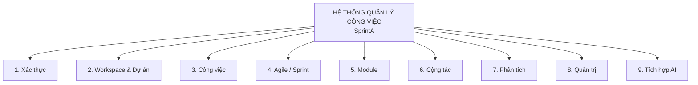

### 1.1 Xác thực & Workspace (Module 1 + 2)

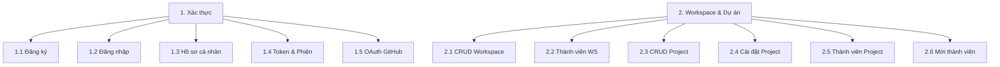

### 1.2 Quản lý Công việc (Module 3)

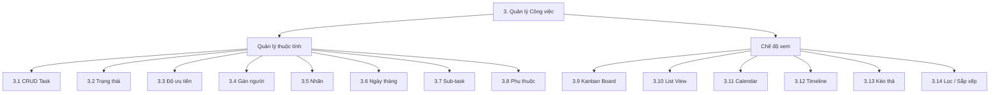

### 1.3 Agile, Module, Cộng tác (Module 4 + 5 + 6)

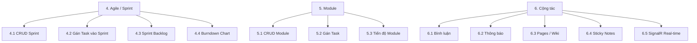

### 1.4 Phân tích, Quản trị, AI (Module 7 + 8 + 9)

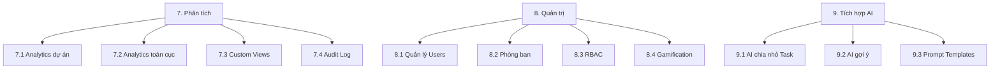

---

## 2. SƠ ĐỒ KIẾN TRÚC HỆ THỐNG (System Architecture)

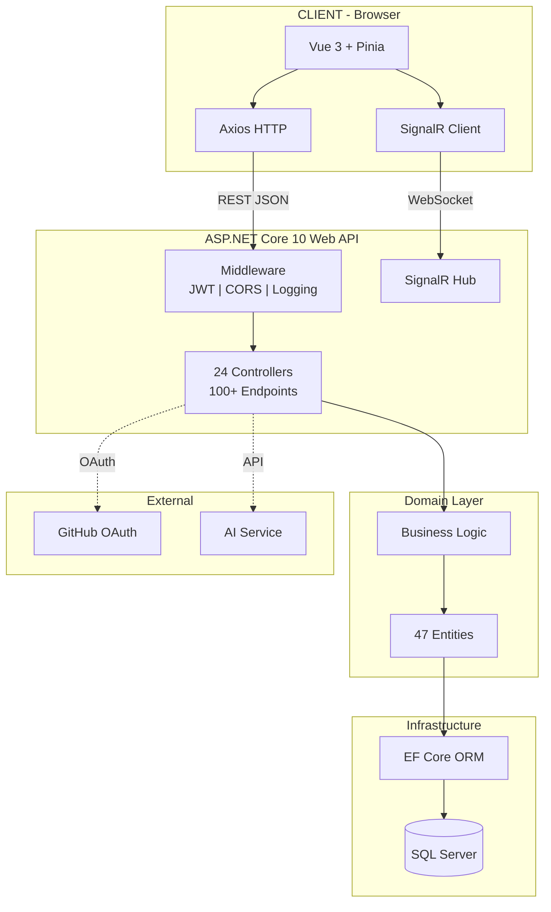

---

## 3. SƠ ĐỒ QUAN HỆ THỰC THỂ - ERD (Core Entities)

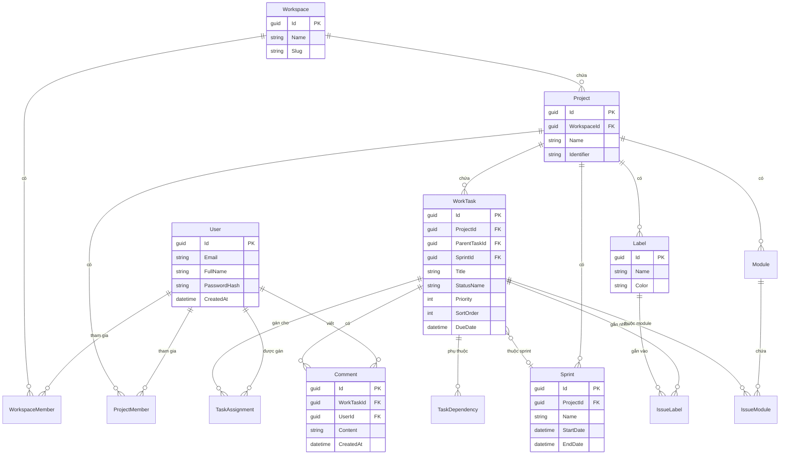

---

## 4. SƠ ĐỒ USE CASE

> **Lưu ý:** Tách thành 3 sơ đồ theo từng Actor để tránh mũi tên chồng chéo, dễ đọc khi in ra giấy.

### 4.1 Use Case - Người dùng (User)

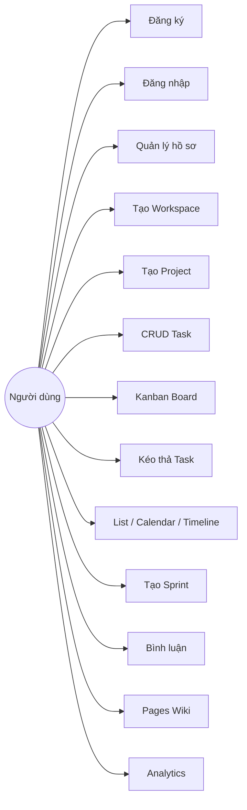

### 4.2 Use Case - Admin

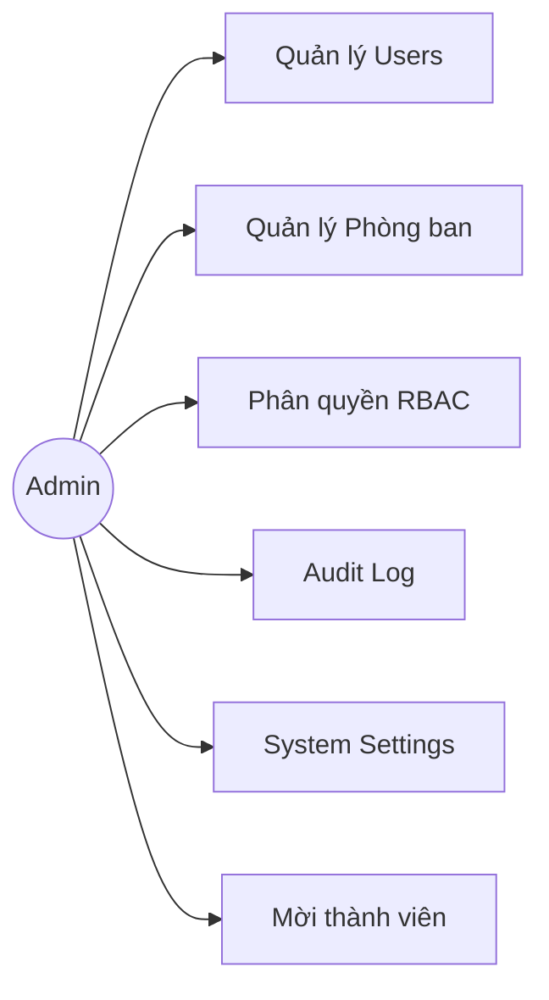

### 4.3 Use Case - AI Agent

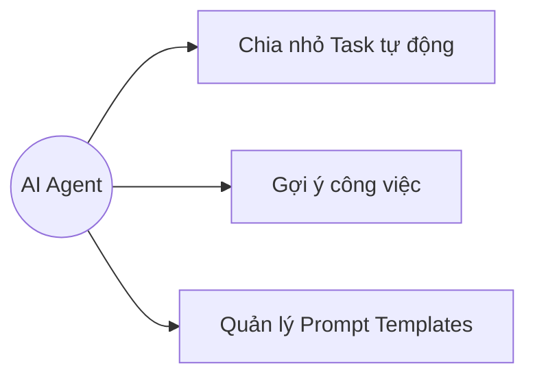

---

## 5. SƠ ĐỒ QUY TRÌNH SCRUM (Scrum Flow)

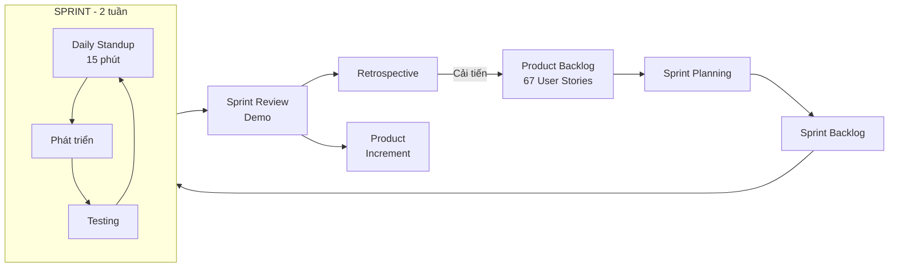

---

## 6. SƠ ĐỒ RELEASE & SPRINT TIMELINE

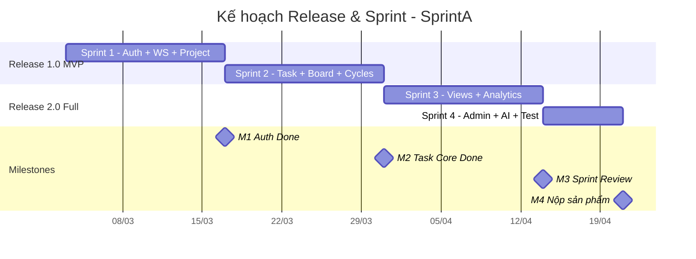

---

## 7. SƠ ĐỒ TRIỂN KHAI (Deployment)

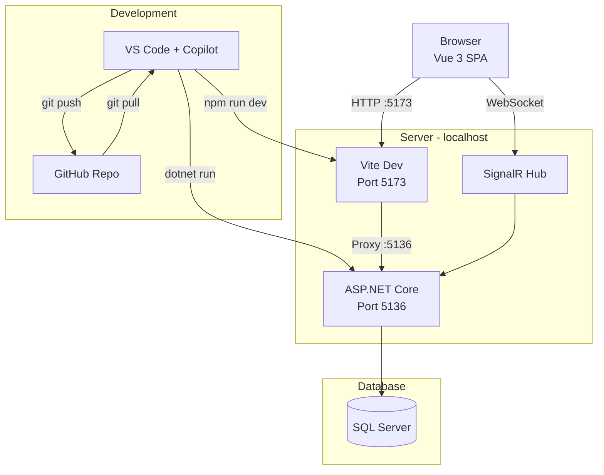

---

## 8. SEQUENCE DIAGRAM: Luồng Đăng Nhập

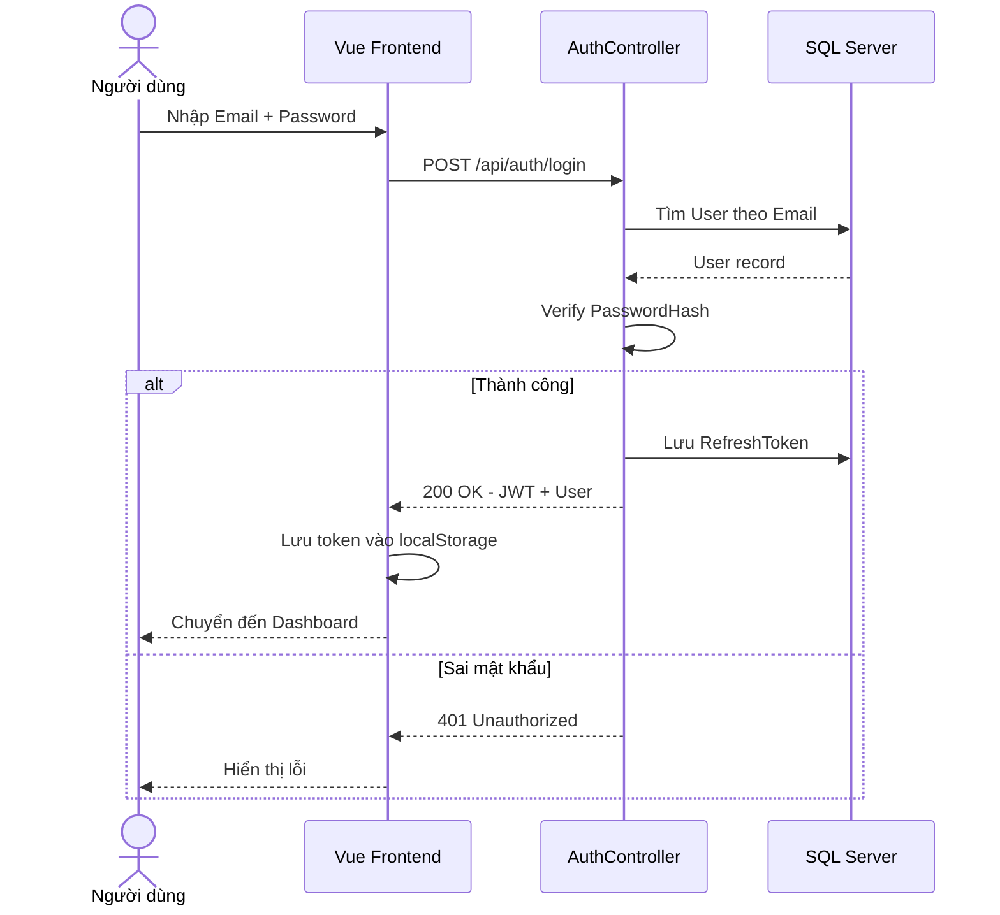

---

## 9. SEQUENCE DIAGRAM: Luồng Kéo Thả Kanban

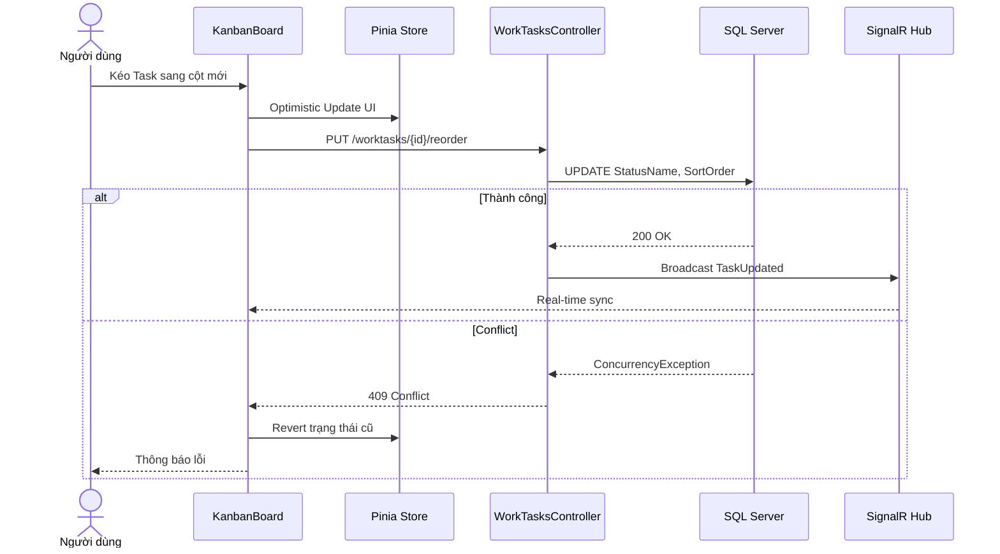

---

## 10. SEQUENCE DIAGRAM: Luồng Tạo Task + Bình Luận

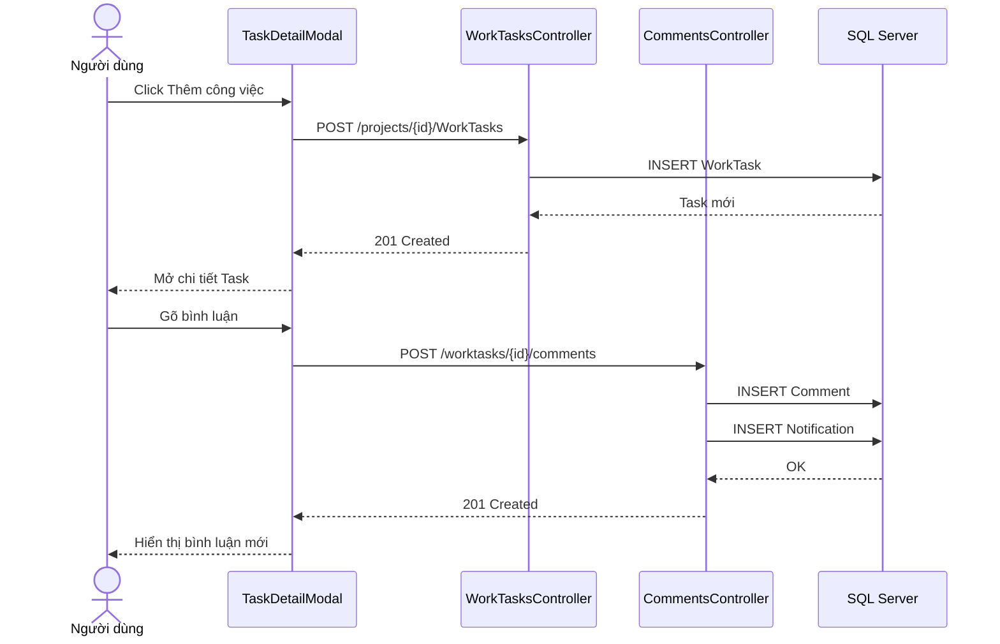

---

## 11. SƠ ĐỒ TRẠNG THÁI TASK (State Diagram)

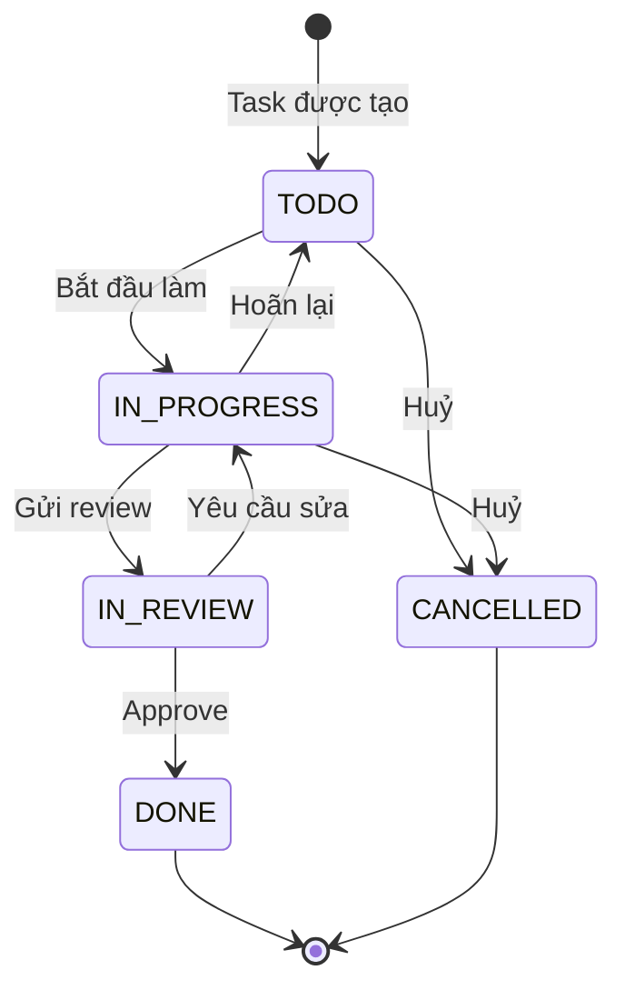

---

## 12. SƠ ĐỒ CLEAN ARCHITECTURE (Layer Diagram)

> **Clean Architecture là gì?**  
> Là cách tổ chức code backend thành **nhiều tầng (layer) tách biệt**, mỗi tầng có trách nhiệm riêng.  
> Mục đích: Khi thay đổi database (ví dụ từ SQL Server sang PostgreSQL), anh CHỈ cần sửa tầng Infrastructure mà không đụng tới code nghiệp vụ (Domain). Tương tự, khi đổi giao diện từ Vue sang React, chỉ sửa tầng Presentation.  
>
> **Ý nghĩa từng tầng trong dự án của anh:**  
> | Tầng | Vai trò | Thư mục trong dự án |
> |------|---------|--------------------|
> | **Presentation** | Giao diện người dùng nhìn thấy | `Frontend/src/` (Vue 3, Pinia) |
> | **API** | Nhận request HTTP, gọi logic xử lý | `TaskManagement.API/Controllers/` |
> | **Application** | Chuyển đổi dữ liệu (DTO), kiểm tra đầu vào | `TaskManagement.Application/` |
> | **Domain** | Quy tắc nghiệp vụ cốt lõi, Entity | `TaskManagement.Domain/Entities/` |
> | **Infrastructure** | Kết nối database, migrations | `TaskManagement.Infrastructure/` |
> | **Data Store** | Cơ sở dữ liệu thực tế | SQL Server |

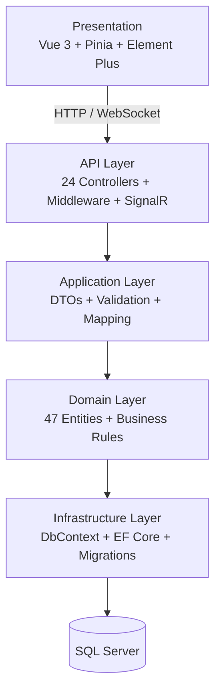

---

> **Ghi chú:**  
> - Tất cả sơ đồ đã được tối ưu để chạy đúng trên Mermaid Live Editor  
> - Sơ đồ phân rã chức năng đã tách thành 5 phần nhỏ để xuất PNG cho rõ chữ  
> - Sơ đồ Use Case tách 3 phần theo Actor để tránh chồng chéo  
> - Xuất PNG/SVG tại: https://mermaid.live
