# 📊 Y1: SƠ ĐỒ PHÂN RÃ CHỨC NĂNG & KẾ HOẠCH PHÂN CÔNG CÔNG VIỆC

**Dự án:** Hệ thống Quản lý Công việc (QuanLyCongViec / SprintA)  
**Ngày lập:** 19/04/2026  
**Nhóm thực hiện:** Nhóm dự án SprintA  

---

## I. SƠ ĐỒ PHÂN RÃ CHỨC NĂNG (Function Decomposition Diagram)

> **Ghi chú:** Sơ đồ chi tiết nên được vẽ bằng Microsoft Visio. Dưới đây là mô tả cấu trúc phân rã:

```mermaid
graph TD
    A["HỆ THỐNG QUẢN LÝ CÔNG VIỆC<br/>(SprintA)"] --> B["1. Quản lý Tài khoản<br/>& Xác thực"]
    A --> C["2. Quản lý Workspace<br/>& Dự án"]
    A --> D["3. Quản lý Công việc<br/>(Work Items)"]
    A --> E["4. Quản lý Agile<br/>(Cycles/Sprints)"]
    A --> F["5. Quản lý Module"]
    A --> G["6. Tương tác & Cộng tác"]
    A --> H["7. Báo cáo & Phân tích"]
    A --> I["8. Quản trị Hệ thống<br/>(Admin)"]
    A --> J["9. Tích hợp AI"]

    B --> B1["1.1 Đăng ký tài khoản"]
    B --> B2["1.2 Đăng nhập / Đăng xuất"]
    B --> B3["1.3 Quản lý hồ sơ cá nhân"]
    B --> B4["1.4 Quản lý token & phiên"]
    B --> B5["1.5 Đăng nhập OAuth (GitHub)"]

    C --> C1["2.1 Tạo / Sửa / Xóa Workspace"]
    C --> C2["2.2 Quản lý thành viên Workspace"]
    C --> C3["2.3 Tạo / Sửa / Xóa Project"]
    C --> C4["2.4 Cài đặt Project"]
    C --> C5["2.5 Quản lý thành viên Project"]
    C --> C6["2.6 Mời thành viên (Invite)"]

    D --> D1["3.1 Tạo / Sửa / Xóa Task"]
    D --> D2["3.2 Quản lý trạng thái (Status)"]
    D --> D3["3.3 Quản lý mức ưu tiên (Priority)"]
    D --> D4["3.4 Gán thành viên (Assignees)"]
    D --> D5["3.5 Quản lý nhãn (Labels)"]
    D --> D6["3.6 Quản lý ngày (Start/Due Date)"]
    D --> D7["3.7 Quản lý mô tả (Rich Editor)"]
    D --> D8["3.8 Tạo Sub-task / Parent task"]
    D --> D9["3.9 Đính kèm tệp (Attachments)"]
    D --> D10["3.10 Quản lý phụ thuộc (Dependencies)"]
    D --> D11["3.11 Xem Kanban Board"]
    D --> D12["3.12 Xem List View"]
    D --> D13["3.13 Xem Calendar View"]
    D --> D14["3.14 Xem Spreadsheet View"]
    D --> D15["3.15 Xem Timeline View"]
    D --> D16["3.16 Kéo thả (Drag & Drop)"]
    D --> D17["3.17 Lọc / Sắp xếp / Tìm kiếm"]
    D --> D18["3.18 Quản lý Draft (Bản nháp)"]

    E --> E1["4.1 Tạo / Sửa / Xóa Cycle (Sprint)"]
    E --> E2["4.2 Gán Task vào Cycle"]
    E --> E3["4.3 Xem danh sách Task trong Cycle"]
    E --> E4["4.4 Burndown Chart"]
    E --> E5["4.5 Quản lý Sprint Backlog"]

    F --> F1["5.1 Tạo / Sửa / Xóa Module"]
    F --> F2["5.2 Gán Task vào Module"]
    F --> F3["5.3 Xem tiến độ Module"]

    G --> G1["6.1 Bình luận (Comments)"]
    G --> G2["6.2 Emoji Reactions"]
    G --> G3["6.3 Thông báo (Notifications)"]
    G --> G4["6.4 Nhật ký hoạt động (Activity Log)"]
    G --> G5["6.5 Ghi chú (Sticky Notes)"]
    G --> G6["6.6 Trang tài liệu (Pages)"]
    G --> G7["6.7 Real-time Updates (SignalR)"]

    H --> H1["7.1 Phân tích dự án (Project Analytics)"]
    H --> H2["7.2 Phân tích toàn cục (Global Analytics)"]
    H --> H3["7.3 Custom Views & Lưu bộ lọc"]
    H --> H4["7.4 Audit Log (Lịch sử thao tác)"]

    I --> I1["8.1 Quản lý người dùng hệ thống"]
    I --> I2["8.2 Quản lý phòng ban (Departments)"]
    I --> I3["8.3 Quản lý vai trò & quyền (RBAC)"]
    I --> I4["8.4 Cài đặt hệ thống (System Settings)"]
    I --> I5["8.5 Gamification (Ví điểm thưởng)"]

    J --> J1["9.1 AI chia nhỏ công việc (Subtasks)"]
    J --> J2["9.2 AI đề xuất gợi ý"]
    J --> J3["9.3 Quản lý Prompt Templates"]
```



---

## II. CHI TIẾT CÁC CHỨC NĂNG VÀ MODULE

### Bảng tóm tắt Module & Entity tương ứng

| STT | Module | Entity Backend | Controller API | Component Frontend |
|-----|--------|---------------|----------------|-------------------|
| 1 | Xác thực | User, RefreshToken | AuthController | Login.vue, Register.vue |
| 2 | Workspace | Workspace, WorkspaceMember | WorkspacesController | ManageSpaces.vue |
| 3 | Project | Project, ProjectMember | ProjectsController, ProjectMembersController | CreateProjectModal.vue, SpaceSummary.vue |
| 4 | Task | WorkTask, TaskAssignment, TaskStatus | WorkTasksController | KanbanBoard.vue, ListView.vue, TaskDetailModal.vue |
| 5 | Labels | Label, IssueLabel | LabelsController | LabelManager.vue |
| 6 | Cycles | Sprint | SprintsController | CyclesTab.vue |
| 7 | Modules | Module, IssueModule | ModulesController | ModulesTab.vue |
| 8 | Comments | Comment, CommentAttachment | CommentsController | (trong TaskDetailModal.vue) |
| 9 | Notifications | Notification | NotificationsController | NotificationsDropdown.vue |
| 10 | Pages | Page | PagesController | PagesTab.vue |
| 11 | Analytics | (aggregate queries) | — | GlobalAnalyticsView.vue |
| 12 | Admin | User, Role, Permission, Department | AdminUsersController | admin/ views |
| 13 | Drafts | TaskDraft | DraftsController | DraftsView.vue |
| 14 | Intake | Intake | IntakesController | IntakeInbox.vue |
| 15 | Sticky Notes | StickyNote | StickiesController | StickiesView.vue |
| 16 | AI | AIFeedback, AIPromptTemplate, AITokenUsage | AiController | AIPage.vue |
| 17 | Audit | AuditLog, SystemAuditLog | AuditLogsController | AuditLog.vue |
| 18 | Gamification | UserWallet, PointTransaction | GamificationController | RewardsView.vue |
| 19 | Views | ProjectView | ProjectViewsController | ViewsTab.vue |
| 20 | Dependencies | TaskDependency | TaskDependenciesController | (trong TaskDetailModal.vue) |

---

## III. KẾ HOẠCH PHÂN CÔNG CÔNG VIỆC

### 3.1 Thông tin nhóm

| STT | Thành viên | Vai trò | Chuyên môn |
|-----|-----------|---------|------------|
| 1 | [Thành viên 1] | Scrum Master / Backend Dev | .NET Core, SQL Server |
| 2 | [Thành viên 2] | Product Owner / Frontend Dev | Vue 3, UI/UX Design |
| 3 | [Thành viên 3] | Backend Developer | API, Database, Security |
| 4 | [Thành viên 4] | Frontend Developer | Vue 3, Component Design |
| 5 | [Thành viên 5] | QA / Tester | Test Case, Automation |

### 3.2 Phân công công việc theo Module

| Module | Người phụ trách | Thời gian ước tính | Ghi chú |
|--------|----------------|--------------------|---------| 
| Xác thực (Auth) | [TV1] + [TV3] | 1 tuần | Login, Register, OAuth GitHub |
| Workspace & Project | [TV1] + [TV4] | 1.5 tuần | CRUD, Members, Settings |
| Task Management (Core) | [TV3] + [TV4] | 2 tuần | CRUD, Properties, Kanban, List |
| Cycles & Modules | [TV1] + [TV4] | 1 tuần | Sprint management |
| Comments & Activity | [TV3] | 1 tuần | Comments, Reactions, Notifications |
| Labels & Views | [TV4] | 1 tuần | Label CRUD, Custom Views, Filters |
| Pages & Stickies | [TV4] | 0.5 tuần | WYSIWYG Editor, Sticky Notes |
| Admin & Settings | [TV1] + [TV3] | 1 tuần | User Management, RBAC, System |
| Analytics & Reports | [TV2] + [TV4] | 1 tuần | Charts, Statistics |
| AI Integration | [TV1] | 0.5 tuần | AI Subtask Split |
| Gamification | [TV3] | 0.5 tuần | Points, Wallet |
| Testing | [TV5] | Xuyên suốt | Test cases, Regression |
| Tài liệu & Slide | [TV2] | 1 tuần | Docs, Presentation |

### 3.3 Biểu đồ Gantt (Microsoft Project / Excel)

> **Ghi chú:** Bản chi tiết nên được lập bằng Microsoft Project. Dưới đây là bản tóm tắt:

```
Tuần 1:  ████████ Auth + Workspace + Project Setup
Tuần 2:  ████████████████ Task Management (Core features)
Tuần 3:  ████████████████ Task Management (Kanban, List, Views)
Tuần 4:  ████████ Cycles & Modules
Tuần 5:  ████████ Comments, Labels, Activity
Tuần 6:  ████████ Pages, Stickies, Admin
Tuần 7:  ████████ Analytics, AI, Gamification
Tuần 8:  ████████ Testing, Fix bugs, Polish
Tuần 9:  ████████ Tài liệu, Slide, Nộp bài
```

### 3.4 Milestones

| Milestone | Ngày dự kiến | Nội dung |
|-----------|-------------|----------|
| M1 | Cuối tuần 1 | Auth + Project Management hoàn thành |
| M2 | Cuối tuần 3 | Task Core (CRUD, Board, List) hoàn thành |
| M3 | Cuối tuần 5 | Sprint 1 Review - Demo chức năng chính |
| M4 | Cuối tuần 7 | Sprint 2 Review - Demo toàn bộ features |
| M5 | Cuối tuần 8 | QA hoàn thành, bugs đã fix |
| M6 | Cuối tuần 9 | Nộp sản phẩm hoàn chỉnh |

---

## IV. CÔNG NGHỆ SỬ DỤNG

| Thành phần | Công nghệ | Phiên bản |
|-----------|-----------|-----------|
| Backend | C# .NET | 10 |
| ORM | Entity Framework Core | Code First |
| Frontend | Vue 3 | Composition API (`<script setup>`) |
| Build Tool | Vite | Latest |
| UI Library | Element Plus | Latest |
| CSS Framework | TailwindCSS | Latest |
| State Management | Pinia | Latest |
| HTTP Client | Axios | Latest |
| Real-time | SignalR | .NET |
| Database | SQL Server | Latest |
| Version Control | Git + GitHub | — |
| Project Management | Trello | — |

---

**Người lập kế hoạch:** ___________  
**Ngày phê duyệt:** ___________  
**Chữ ký:** ___________
